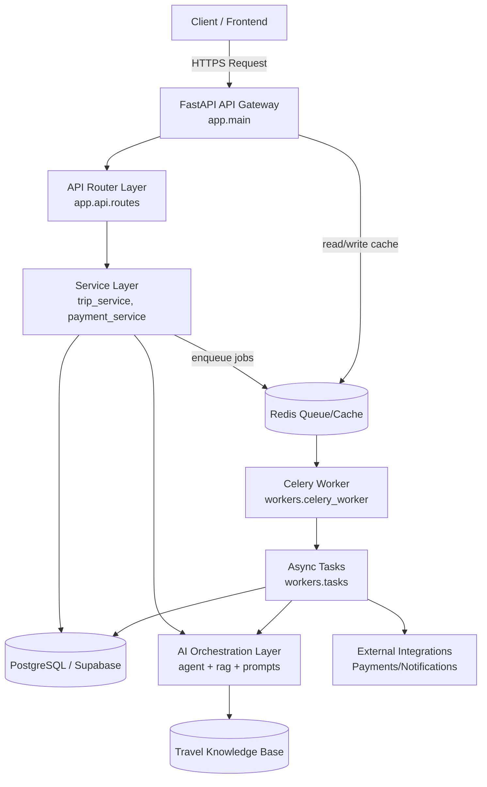

# Backend System Design

This flowchart describes the backend request and async-processing architecture.

## Request/Processing Flow

1. A client request arrives at the FastAPI API gateway.
2. The router dispatches to domain services for business logic.
3. Services perform synchronous work (DB reads/writes, AI calls) and return the API response.
4. Long-running work is queued in Redis.
5. Celery workers consume queued jobs and execute async tasks.
6. Async tasks update persistent state, call AI/integrations, and complete in the background.

## Backend Components Mapped to Repository

- API gateway: `backend/app/main.py`
- Routing/dependencies: `backend/app/api/routes.py`, `backend/app/api/deps.py`
- Services: `backend/app/services/`
- AI layer: `backend/app/ai/`
- Worker entrypoint: `backend/workers/celery_worker.py`
- Worker tasks: `backend/workers/tasks.py`
- Database/session config: `backend/app/db/`